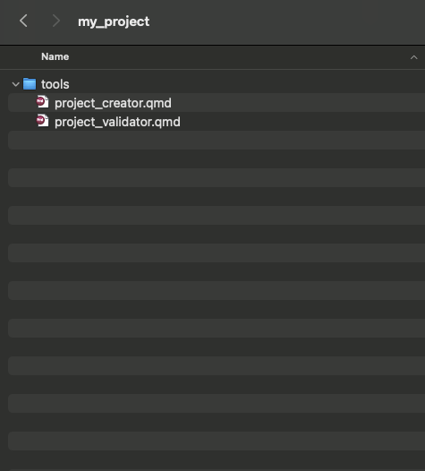
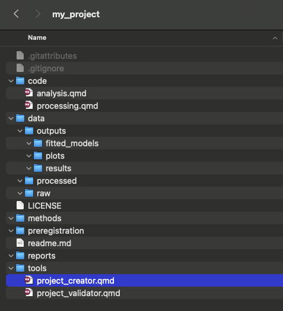
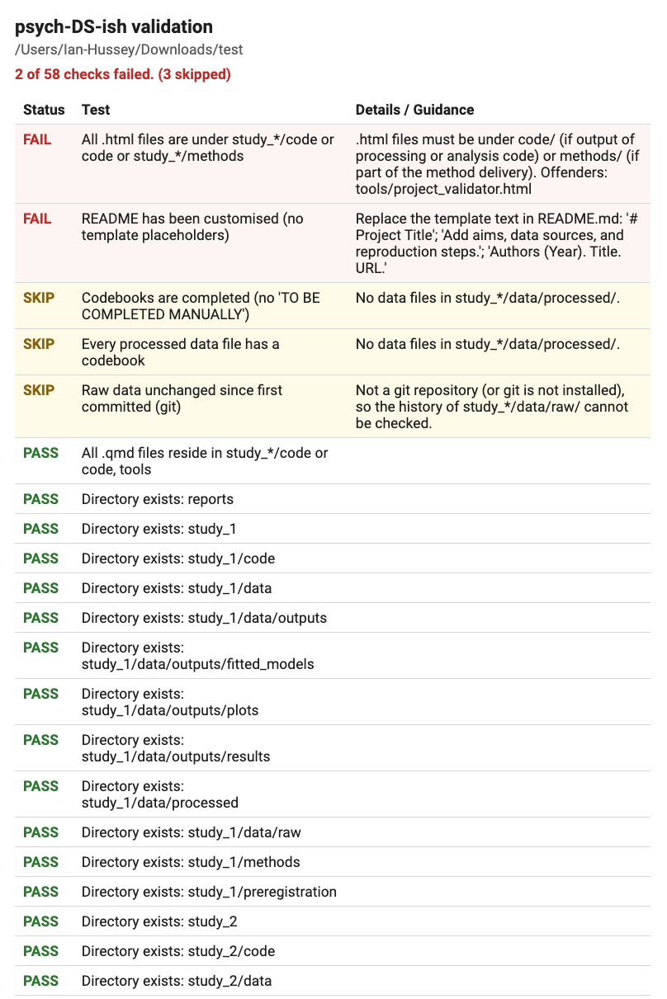

# psych-DS-ish

<!-- badges: start -->
[](https://github.com/ianhussey/psychdsish/actions/workflows/R-CMD-check.yaml)

[](https://lifecycle.r-lib.org/articles/stages.html#experimental)

[](https://opensource.org/licenses/MIT)

[](https://doi.org/10.5281/zenodo.21441984)
<!-- badges: end -->

Standardization of project structures is both very useful and, let's face it, not very exciting or at the top of anyone's To Do list. I wanted to make it easier, both in my own research and to teach students good practices. 

{psychdsish} creates a standardized project skeleton that is compliant-ish with [psych-DS](https://psych-ds.github.io/) and also adds several features to improve reproducibility, such Quarto templates, a readme template, CC BY licence, and a .gitignore with reasonable defaults. 

It also has a validator function that lets users check that their project is still compliant with the standard and, if not, tells them how to rectify it.

## Installation

You can install the development version of `psychdsish` from GitHub with:

``` r
# install.packages("remotes")
remotes::install_github("ianhussey/psychdsish")
```

## Quickstart

In RStudio, from a standing start:

1. **Create a project.** *File > New Project > New Directory > psych-DS-ish Project*. Give it a directory name, set the number of studies if there is more than one, and click *Create Project*. You get the folder structure below, a README, a licence, a `CITATION.cff`, a `.gitignore`, and Quarto templates for processing and analysis code, opened ready to work on.

2. **Write your code.** Put your raw data in `data/raw/`, then write `code/processing.qmd` to clean it and `code/analysis.qmd` to analyse it. Each file runs from its own folder, so paths are relative, e.g. `../data/raw/my_data.csv`. `processing.qmd` includes a chunk that creates a codebook describing every variable in your processed data.

3. **Reproduce all results.** Click *Build > Render Project* (top right). This renders `processing.qmd` and then `analysis.qmd`, in the order listed in `_quarto.yml`, so your results are always regenerated from the raw data in the right order. Rendering stops at the first error.

4. **Check the project.** Click *Addins > Validate psych-DS-ish project*. The results appear in the console and as a table in the Viewer pane, with guidance on how to fix anything that fails.

Not using RStudio? Steps 1, 3 and 4 are `psychdsish::create_project_skeleton("~/git/my_project")`, `quarto::quarto_render()` and `psychdsish::validator(".")` from the R console.

## Data Standards

I am a big fan of the concept of standards, and the [psych-DS](https://psych-ds.github.io/) data standard specifically. Huge credit to Melissa Klein Struhl for leading it and all the psych-DS team.

*But*:

1. I am not convinced that psych-DS's .json requirement should be the *starting point* for most users. a) .json files are a pain to write by hand, and b) they are currently very rarely used in psychology workflows. So I didn't want creating one to be the price of entry for my students. Since the metadata can be generated from a codebook that people fill in anyway, psychdsish now supports it: it just isn't required.
2. psych-DS is purposefully light-weight on what it requires users to do to be compliant. I'm ok being slightly more heavy handed given that my use case is a) my own projects and b) students in my R/tidyverse classes (see my book at [wrangling.tidyver.se](https://wrangling.tidyver.se/)).
3. psych-DS focuses on *testing* compliance with the standard but not *assisting* the user in setting up a project that is compliant in the first place. Approached as a human-factors problem, this is likely to decrease uptake of psych-DS, given that tidying up a project after the fact is usually harder than providing a template up front.

## psych-DS-ish

psych-DS-ish is an R package that therefore: 1) makes the .json optional rather than required - `write_dataset_description()` generates it from the project's codebooks when you want it, and `validator()` reports its absence as a warning rather than a failure - and 2) provides functions to create skeleton project structures (`create_project_skeleton()`) or delete them (for testing purposes: `delete_project_skeleton()`) and validate a given project against psych-DS-ish rules (`validator()`). 

Does this contribute to Standards Proliferation? Yes, unfortunately. 

[](https://xkcd.com/927/)

*[xkcd 927: "Standards"](https://xkcd.com/927/) by Randall Munroe, [CC BY-NC 2.5](https://creativecommons.org/licenses/by-nc/2.5/).*

psych-DS-ish makes no attempt to define or maintain the standard itself, which is its weak point and psych-DS's strength. I have no desire to duplicate psych-DS's great work there; psych-DS-ish is intended to be a code tool not a full data standard. psych-DS-ish could be updated in future to bring it more in line with psych-DS, or psych-DS could distribute, fork, or otherwise make use of psych-DS-ish's skeleton generation tool. 

## Goal project structure

This is the project structure I use and teach. Data and codebook file names follow the psych-DS convention of `key-value` pairs ending in `_data`, and `dataset_description.json` is optional (see [Codebooks and psych-DS metadata](#codebooks-and-psych-ds-metadata)):

``` text
github_repository_name/
├── .gitattributes
├── .gitignore
├── code/
│   ├── analysis.html
│   ├── analysis.qmd
│   ├── processing_study_1.html
│   ├── processing_study_1.qmd
│   ├── processing_study_2.html
│   ├── processing_study_2.qmd
│   └── ...
├── data/
│   ├── processed/
│   │   ├── study-1_stage-processed_data.csv
│   │   ├── study-1_stage-processed_codebook.xlsx
│   │   ├── study-2_stage-processed_data.csv
│   │   ├── study-2_stage-processed_codebook.xlsx
│   │   └── ...
│   ├── raw/
│   │   ├── study-1_task-behavioral_stage-raw_data.csv
│   │   ├── study-2_task-behavioral_stage-raw_data.csv
│   │   ├── study-1_task-behavioral_stage-raw_codebook.xlsx
│   │   ├── study-2_task-behavioral_stage-raw_codebook.xlsx
│   │   ├── study-1_task-demographics_stage-raw_data.csv
│   │   ├── study-2_task-demographics_stage-raw_data.csv
│   │   ├── study-1_task-selfreports_stage-raw_data.csv
│   │   ├── study-2_task-selfreports_stage-raw_data.csv
│   │   └── ...
│   └── outputs/
│       ├── plots/
│       │   ├── plot_1_self_reports.png
│       │   ├── plot_2_behavioral_task.png
│       │   └── ...
│       ├── fitted_models/
│       │   ├── fit_model_1.rds
│       │   ├── fit_model_2.rds
│       │   └── ...
│       ├── results/
│       │   ├── cor_matrix_study_1.csv
│       │   ├── cor_matrix_study_2.csv
│       │   └── ...
│       └── ...
├── dataset_description.json
├── LICENSE
├── methods/
│   ├── study_1/
│   │   ├── replication_instructions.docx
│   │   ├── study_1_labjs.json
│   │   ├── study_1_measures_and_procedure.docx
│   │   └── ...
│   └── study_2/
│       ├── replication_instructions.docx
│       ├── study_2_labjs.json
│       ├── study_2_measures_and_procedure.docx
│       └── ...
├── preregistration/
│   └── preregistration.docx
├── README.md
├── reports/
│   ├── preprint/
│   │   ├── preprint.docx
│   │   └── ...
│   ├── presentations/
│   │   ├── conference_presentation.pptx
│   │   └── ...
│   └── ...
└── tools/
    ├── project_creator.qmd
    ├── project_validator.qmd
    └── ...
```


## Creating a new project

**GUI option in RStudio:** after installing psychdsish, restart RStudio, then go to *File > New Project > New Directory > psych-DS-ish Project*. Enter a directory name, choose whether to create a `_quarto.yml` (on by default), and click *Create Project*. RStudio creates the skeleton below, opens it as a project, and opens `README.md`, `code/processing.qmd`, and `code/analysis.qmd`.

**CLI option in RStudio, Positron, or any other editor:** Run this from the R console, then open the folder:

``` r
psychdsish::create_project_skeleton(project_root = "~/git/my_project")
```

## Validating a project

**GUI option in RStudio:** with the project open, click *Addins > Validate psych-DS-ish project* in the toolbar. The results are printed in the console and shown as a colour-coded table in the Viewer pane. To run it with a keyboard shortcut, go to *Tools > Modify Keyboard Shortcuts* and search for "psych-DS-ish".

**CLI option in RStudio, Positron, or any other editor:** Run this from the R console in the project root:

``` r
psychdsish::validator(".")
```

Alternatively, render `tools/project_validator.qmd` for an HTML report, or use `validator(".", strict = TRUE)` to throw an error on any failure, e.g., in a GitHub Actions workflow.

## Skeleton project structure created by `create_project_skeleton()`

This is the skeleton that  `create_project_skeleton()` creates:

```text
github_repository_name/
├── .gitattributes  # ignores .html files to help github detect R repos
├── .gitignore  # includes reasonable defaults
├── _quarto.yml  # renders code/processing.qmd then code/analysis.qmd via `quarto render` (skip with `quarto_yml = FALSE`)
├── CITATION.cff  # citation metadata template: gives a 'Cite this repository' button on GitHub
├── github_repository_name.Rproj  # RStudio project file, named after the project folder (skip with `rproj = FALSE`)
├── LICENSE  # CC BY 4.0
├── README.md  # including overview, structure, reproduciblity instructions, license, suggested citation
├── code/
│   ├── analysis.qmd  # template created
│   └── processing.qmd  # template created
├── data/
│   ├── outputs/
│   │   ├── fitted_models/
│   │   ├── plots/
│   │   └── results/
│   ├── processed/
│   └── raw/
├── methods/
├── preregistration/
├── reports/
└── tools/
    ├── project_creator.qmd  # re-runs create_project_skeleton() from within the project
    ├── project_validator.qmd  # runs validator() on the project
    └── style_all_files.qmd  # applies tidyverse code style to all .qmd, .Rmd, and .R files
```


## Multi-study projects

For projects with more than one study, set `studies`, and choose a `layout`:

``` r
# one folder per study (default)
create_project_skeleton("~/git/my_project", studies = 2)

# one subfolder per study inside each folder
create_project_skeleton("~/git/my_project", studies = 2, layout = "by_type")
```

In the RStudio New Project wizard, set *Number of studies* and *Multi-study layout*.

`layout = "by_study"` gives each study the single-study structure, so paths in the code are the same as in a single-study project (e.g., `../data/raw/`):

```text
github_repository_name/
├── study_1/
│   ├── code/
│   │   ├── analysis.qmd
│   │   └── processing.qmd
│   ├── data/
│   │   ├── outputs/
│   │   ├── processed/
│   │   └── raw/
│   ├── methods/
│   └── preregistration/
├── study_2/  # same structure as study_1/
├── reports/  # shared by all studies
└── tools/
```

`layout = "by_type"` keeps one `code/`, `data/`, etc., with a subfolder per study inside each, so paths in the code gain a level (e.g., `../../data/raw/study_1/`):

```text
github_repository_name/
├── code/
│   ├── study_1/
│   │   ├── analysis.qmd
│   │   └── processing.qmd
│   └── study_2/
├── data/
│   ├── outputs/
│   │   ├── fitted_models/study_1/, study_2/
│   │   ├── plots/study_1/, study_2/
│   │   └── results/study_1/, study_2/
│   ├── processed/study_1/, study_2/
│   └── raw/study_1/, study_2/
├── methods/study_1/, study_2/
├── preregistration/study_1/, study_2/
├── reports/  # shared by all studies
└── tools/
```

In both layouts, the root-level files (README, LICENSE, `CITATION.cff`, `.gitignore`, `_quarto.yml`, `.Rproj`) are shared, and `_quarto.yml` renders each study's processing and analysis files in turn. To add a study later, increase `studies` in `tools/project_creator.qmd` and render it, then add the new files to `_quarto.yml`. `validator()` detects the layout automatically. Analyses that combine studies can go in a root-level `code/` folder (by study) or in `code/` outside the study subfolders (by type).

## Codebooks and psych-DS metadata

`code/processing.qmd` contains a chunk that creates a codebook (data dictionary) from the processed data: it fills in each variable's type, number of missing values, and range or values, and marks `description`, `units`, and `coding` as "TO BE COMPLETED MANUALLY" for the user to fill in. Re-rendering keeps their entries and adds any new variables.

Generated data and codebook file names follow the [psych-DS](https://psych-ds.github.io/) convention of `key-value` pairs ending in `_data`, e.g., `study-1_stage-processed_data.csv` and `study-1_stage-processed_codebook.csv`.

Users then have two options, and need only one:

- **The codebook .csv** is the simpler route: easy to fill in and read, and all that `validator()` requires.
- **`dataset_description.json`** is the more psych-DS compliant route. `write_dataset_description()` writes it in the project root from the codebooks, mapping each codebook row onto a `PropertyValue` in `variableMeasured`, so each variable is still described only once:

``` r
psychdsish::write_dataset_description(
  project_root = ".",
  name = "My study",
  description = "What the dataset contains"
)
```

  `processing.qmd` includes this call in a chunk that is not run by default. Note that psychdsish does not check psych-DS compliance itself: use the [psych-DS validator](https://psych-ds.github.io/validator/) for that.

## Validation rules checked by `validator()`

A project is **psych-DS(ish)-compliant** if it follows all of the following rules:

| **File / Directory type** | **Allowed** | **Forbidden** |
|---------------------------|-------------|---------------|
| **Required directories**  | `code/`, `data/`, `data/raw/`, `data/processed/`, `data/outputs/`, `data/outputs/plots/`, `data/outputs/fitted_models/`, `data/outputs/results/`, `methods/`, `reports/`, `preregistration/` | Missing any of these directories |
| **Required files**        | `readme.md` (case-insensitive), license file (`LICENSE` preferred) | Missing either required file |
| **.qmd**, **.Rmd**, **.R** | In `code/` or `tools/` | Anywhere else |
| **.csv**, **.xlsx**, **.tsv**, **.dta**, **.sav**, **.feather**, **.rds** | In `data/` | Anywhere else (including `code/`) |
| **.pdf**                  | In `data/outputs/`, `data/raw/`, `reports/`,  `preregistration/`, or `methods/` | Anywhere else |
| **.png**                  | In `data/outputs/plots/` or `data/raw/` | Anywhere else |
| **.docx**                 | In `reports/`, `methods/`, `preregistration/`, `data/outputs/results/`, or `data/raw/` | Anywhere else |
| **.html**                 | In `code/` or `methods/` | Anywhere else |
| **Data-like files under `code/`** | None | Any `.csv`, `.xlsx`, `.tsv`, `.sav`, `.dta`, `.feather`, `.rds` |
| **.gitignore**            | Present and configured to ignore R session files, caches, large binaries | Absent |
| **Filenames**             | No spaces | Any filename containing spaces |
| **Raw data** (requires git) | Unchanged since first committed; adding new raw files is fine | Modifying or deleting committed files in `data/raw/`, including uncommitted changes |
| **Rendered .html**        | Newer than its `.qmd` | A `.qmd` changed since its `.html` was last rendered |
| **README.md**             | Customised | Still contains the template placeholders from `create_project_skeleton()` |
| **R code** (`.R` files and `.qmd`/`.Rmd` code chunks) | Relative paths, e.g., `../data/raw/` | `setwd()` calls; absolute paths, e.g., `"~/"`, `"/Users/"`, `"C:/"` |
| **Codebooks**            | Every data file under `data/` is documented: a codebook named after it (e.g., `study-1_stage-processed_data.csv` -> `study-1_stage-processed_codebook.csv`), a psych-DS sidecar `.json`, or its columns listed in `dataset_description.json`, with no "TO BE COMPLETED MANUALLY" placeholders left | Data files without a codebook; placeholders left in a codebook |

Three further checks are reported as `WARN` rather than `FAIL`, because they concern psych-DS compliance rather than the project being broken: data file names that do not follow the psych-DS `key-value` convention (leniently for raw data, which often cannot be renamed), data files described only by a `.csv`/`.xlsx` codebook rather than in `dataset_description.json`, and codebooks or `.json` files that cannot be matched to the data file they describe. Warnings do not affect `validator(strict = TRUE)`.

Checks that cannot be run (e.g., the raw data check in a project that is not a git repository) are reported as `SKIP`. Use `validator(strict = TRUE)` to throw an error if any check fails, e.g., to fail a GitHub Actions job.


### Usage

Before running the 'project_creator.qmd' script:


<br>

After running the 'project_creator.qmd' script:


<br>

You can also use the function directly from the console without needing the .qmd file, if you know your project's file path. E.g., `psychdsish::create_project_skeleton(project_root = "~/git/my_project")`.

<br>

Results of `validator()` in a freshly generated project skeleton - note that some tests are not printed unless failed. 



<br>

## License

Code is MIT licenced © Ian Hussey (2025-2026)

## Suggested citation

Hussey, I. (2026). psychdsish: Keep data, R code, and outputs organized and reproducible. [Computer software] [https://github.com/ianhussey/psychdsish](https://github.com/ianhussey/psychdsish) [doi:10.5281/zenodo.21441984](https://doi.org/10.5281/zenodo.21441984).
